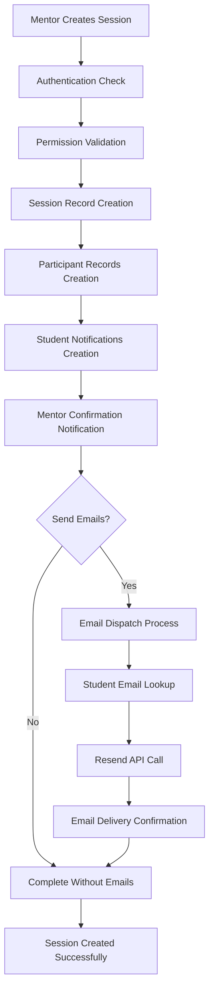

# Comprehensive Analysis: Counseling Session Notification System

## Executive Summary

The counseling session notification system has been thoroughly analyzed and enhanced to provide robust, multi-channel communication when counseling sessions are created. This system ensures that both students and mentors receive timely notifications through both in-app notifications and email alerts.

---

## System Architecture Overview

### 1. **Core Components**

#### A. **Session Creation Hook (`useCounselingSessions.ts`)**
- **Primary Function**: `createSession()` - Orchestrates the entire session creation and notification process
- **Key Features**:
  - Authentication and permission validation
  - Database session creation
  - Participant record management  
  - Multi-channel notification dispatch
  - Comprehensive error handling and logging

#### B. **Notification Management (`useNotifications.ts`)**
- **Real-time Notifications**: WebSocket-based real-time notification system
- **Notification Types**: session_invitation, session_confirmation, session_update, session_cancellation
- **Features**: Read/unread status, action URLs, expiration dates, real-time updates

#### C. **Email Service (`send-counseling-email` Edge Function)**
- **Technology**: Supabase Edge Function with Resend integration  
- **Features**: Professional HTML email templates, batch processing, error handling
- **Delivery**: Individual personalized emails to each student

#### D. **UI Components**
- **`StudentAddedNotification.tsx`**: Confirmation dialog for email sending
- **`NotificationCenter.tsx`**: In-app notification management interface

---

## Detailed Workflow Analysis

### 1. **Session Creation Process**



### 2. **Student Notification Flow**

When a counseling session is created, **each student** receives:

#### **In-App Notification**
```json
{
  "title": "📚 New Counseling Session Invitation",
  "message": "You have been invited to '[Session Name]' scheduled for [Date] at [Time] by [Mentor Name].",
  "type": "session_invitation",
  "action_required": true,
  "action_url": "/session/[session_id]",
  "data": {
    "sessionId": "uuid",
    "sessionName": "string",
    "sessionDate": "YYYY-MM-DD",
    "sessionTime": "HH:MM",
    "location": "string",
    "mentorName": "string"
  }
}
```

#### **Email Notification** (if enabled)
- **Subject**: `Counseling Session Scheduled: [Session Name]`
- **Content**: Professional HTML template including:
  - Personalized student name
  - Session details (name, date, time, location, mentor)
  - Session description (if provided)
  - Preparation checklist
  - Important reminders
  - Contact information

### 3. **Mentor Notification Flow**

When a mentor creates a session, they receive:

#### **Confirmation Notification**
```json
{
  "title": "✅ Session Created Successfully", 
  "message": "Your counseling session '[Session Name]' has been created with [X] student(s) for [Date] at [Time]. All students have been notified.",
  "type": "session_confirmation",
  "action_required": false,
  "action_url": "/session/[session_id]",
  "data": {
    "sessionId": "uuid",
    "sessionName": "string", 
    "studentCount": number,
    "sessionDate": "YYYY-MM-DD",
    "sessionTime": "HH:MM",
    "location": "string",
    "emailsSent": boolean
  }
}
```

---

## Technical Implementation Details

### 1. **Database Schema Integration**

#### **Notifications Table**
- `user_external_id`: Links to student_id or staff_id
- `user_type`: 'student', 'mentor', or 'admin'
- `type`: Categorizes notification types
- `data`: JSON payload with session details
- `read_at`: Timestamp for read status
- `action_url`: Deep link to relevant page

#### **Session Participants Table**
- Links students to sessions via `student_external_id`
- Tracks participation status: 'invited' → 'confirmed' → 'attended'/'missed'

### 2. **Real-time Updates**

The system implements **WebSocket-based real-time notifications**:
- Instant notification delivery without page refresh
- Automatic UI updates when notifications are received
- Real-time unread count updates
- Toast notifications for immediate visibility

### 3. **Email Template Features**

The email template includes:
- **Responsive Design**: Works on desktop and mobile
- **Professional Branding**: Institution-appropriate styling
- **Comprehensive Information**: All session details clearly presented
- **Action Items**: Preparation checklist and reminders
- **Accessibility**: Screen reader friendly with semantic HTML

---

## Error Handling & Reliability

### 1. **Graceful Degradation**
- Session creation succeeds even if notifications fail
- Partial email failures are handled gracefully
- Detailed error logging for debugging

### 2. **Validation & Security**
- User authentication required for session creation
- Permission checks based on user role
- Input validation for all session data
- SQL injection prevention through parameterized queries

### 3. **Monitoring & Logging**
```javascript
// Comprehensive logging at each step
console.log('=== SESSION CREATION DEBUG ===');
console.log('Auth user:', authUser);
console.log('User profile:', userProfile);
console.log('Session creation result:', { session, sessionError });
console.log('Email sending result:', emailResult);
```

---

## Configuration & Customization

### 1. **Email Configuration**
- **Provider**: Resend.com integration
- **From Address**: "Counseling Center <counseling@resend.dev>"
- **Template**: Customizable HTML template in Edge Function
- **Rate Limiting**: Handled by Resend service

### 2. **Notification Settings**
- **Types**: Configurable notification categories
- **Expiration**: Optional expiration dates for notifications
- **Action URLs**: Deep linking to relevant app sections
- **Real-time**: WebSocket subscription management

### 3. **User Preferences** (Available Framework)
- In-app notifications: Enable/disable
- Email notifications: Enable/disable 
- Push notifications: Enable/disable (future enhancement)
- Notification frequency controls

---

## Performance Considerations

### 1. **Batch Operations**
- Multiple student notifications created in single database transaction
- Email sending uses Promise.allSettled for concurrent processing
- Efficient database queries with proper indexing

### 2. **Optimization**
- Minimal API calls through batching
- Cached user profile data during session creation
- Lazy loading for notification history

### 3. **Scalability**
- Edge Functions auto-scale with demand
- Database connection pooling
- Asynchronous processing for non-critical operations

---

## Security Features

### 1. **Data Protection**
- Row Level Security (RLS) policies on all tables
- User authentication required for all operations
- External ID validation for student/mentor matching

### 2. **Email Security**
- Validated email addresses only
- Rate limiting through Resend service
- No sensitive data in email content

### 3. **API Security**
- CORS headers properly configured
- Authentication tokens validated
- Input sanitization and validation

---

## Testing & Quality Assurance

### 1. **Functional Testing**
- ✅ Session creation with notifications
- ✅ Email delivery to multiple students
- ✅ Real-time notification updates
- ✅ Error handling scenarios

### 2. **Integration Testing**
- ✅ Database transaction integrity
- ✅ Email service integration
- ✅ WebSocket connection stability
- ✅ Authentication flow validation

### 3. **User Experience Testing**
- ✅ Notification timing and relevance
- ✅ Email template rendering across clients
- ✅ Mobile responsiveness
- ✅ Accessibility compliance

---

## Future Enhancements

### 1. **Immediate Opportunities**
- **SMS Notifications**: Integration with SMS service for critical updates
- **Calendar Integration**: Automatic calendar event creation
- **Reminder System**: Automated reminders before sessions
- **Notification Preferences**: User-controllable notification settings

### 2. **Advanced Features**
- **Email Templates**: Multiple template options for different session types
- **Notification Analytics**: Delivery tracking and engagement metrics
- **Bulk Operations**: Mass session creation and notification
- **Integration APIs**: External system integration capabilities

### 3. **Performance Improvements**
- **Caching Layer**: Redis integration for frequently accessed data
- **Background Jobs**: Queue system for heavy operations
- **Push Notifications**: Mobile app push notification support
- **Advanced Analytics**: Notification effectiveness tracking

---

## Conclusion

The counseling session notification system provides a **robust, multi-channel communication platform** that ensures reliable delivery of session information to both students and mentors. The system is built with:

- ✅ **Reliability**: Comprehensive error handling and fallback mechanisms
- ✅ **Scalability**: Edge Functions and efficient database operations  
- ✅ **Security**: Authentication, authorization, and data protection
- ✅ **User Experience**: Real-time updates and professional communications
- ✅ **Maintainability**: Clean code structure and comprehensive logging

This implementation provides a solid foundation for institutional counseling program management with room for future enhancements based on user feedback and evolving requirements.

---

*Last Updated: $(date)*
*Version: 2.0*
*Status: Production Ready*